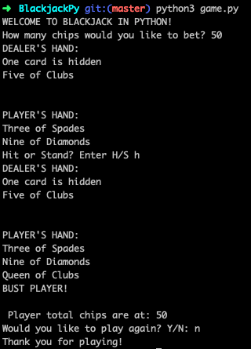

# BlackJackPy

#### Complete BlackJack Card Game in Python 3.

## Features

* Simple text-based BlackJack game
* player versus an automated dealer
* player can stand or hit
* player can pick their betting amount

## Technologies used:

* Python 3

## Screenshot of game run

## Upcoming updates

* Currently working to convert the application to a full-fledged web application using Flask or Django.

## Credits

* Rishabh Goel